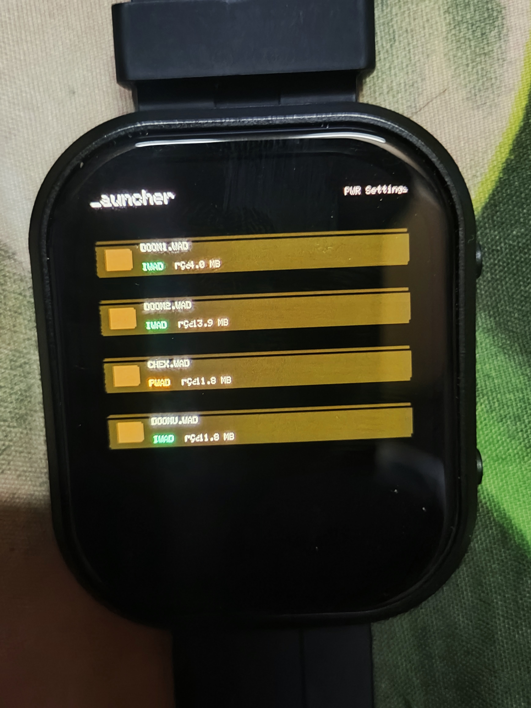
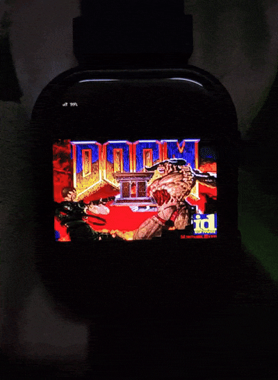
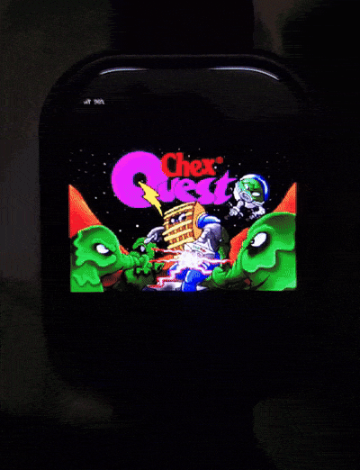
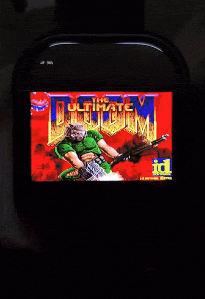

# DOOM Watch

> Play classic DOOM on an ESP32 AMOLED smartwatch with touch controls, motion controls, audio, battery monitoring, and WAD management.

## Support / Get It

If you like this project, you can support me on [Ko-fi](https://ko-fi.com/s/c68a796d12) ☕

# Picker

## Features
- Classic DOOM gameplay using DoomGeneric
- IWAD and PWAD support
- Custom WAD launcher
- Per-WAD save folders (auto-created)
- Touch drag joystick
- Physical button controls
- ES8311 **SFX support only** (audio playback can be added if requested)
- AXP2101 battery HUD
- Adjustable volume, brightness, battery HUD, and control sensitivity
- IMU wrist-tilt motion controls
- Save-name macro for quick saves

# Demo

## Hardware
Tested hardware: [ESP32-S3 Touch AMOLED 2.06](https://www.waveshare.com/wiki/ESP32-S3-Touch-AMOLED-2.06)

## Controls

| Action | Control |
|---|---|
| Move forward/back | Touch drag up/down |
| Turn left/right | Touch drag left/right |
| Fire / Select | BOOT button |
| Use / Open | Top-right screen tap |
| Weapon cycle | Top-left screen tap |
| Menu / Back | PWR button |
| Auto save-name | BOOT + PWR |

## Required Libraries
- Arduino_GFX_Library
- Arduino_DriveBus_Library
- ESP_I2S
- XPowersLib
- Preferences
- SD_MMC
- DoomGeneric

## DoomGeneric Setup
Need help? Text me on (https://www.instagram.com/tsixom)

